# Ex-07-Data-Visualization-

## AIM
To Perform Data Visualization on the given dataset and save the data to a file. 

# Explanation
Data visualization is the graphical representation of information and data. By using visual elements like charts, graphs, and maps, data visualization tools provide an accessible way to see and understand trends, outliers, and patterns in data.

# ALGORITHM
### STEP 1
Read the given Data
### STEP 2
Clean the Data Set using Data Cleaning Process
### STEP 3
Apply Feature generation and selection techniques to all the features of the data set
### STEP 4
Apply data visualization techniques to identify the patterns of the data.


# CODE
```python
import pandas as pd
import numpy as np
import seaborn as sns
df=pd.read_csv('Superstore.csv',encoding="ISO-8859-1")
df

df.info()

df.isnull().sum()

import matplotlib.pyplot as plt
sns.lineplot(x="Segment",y="Sales",data=df,marker='o')
plt.title("Segment vs Sales")
plt.xticks(rotation = 90)
plt.show()

df.shape
df1 = df[(df.Profit >= 60)]
df1.shape

plt.figure(figsize=(30,8))
states=df1.loc[:,["City","Profit"]]
states=states.groupby(by=["City"]).sum().sort_values(by="Profit")
sns.barplot(x=states.index,y="Profit",data=states)
plt.xticks(rotation = 90)
plt.xlabel=("City")
plt.ylabel=("Profit")
plt.show()

sns.barplot(x="Ship Mode",y="Profit",data=df)
plt.show()

sns.lineplot(x="Ship Mode",y="Profit",data=df)
plt.show()

states=df.loc[:,["Region","Sales"]]
states=states.groupby(by=["Region"]).sum().sort_values(by="Sales")
sns.barplot(x=states.index,y="Sales",data=states)
plt.xticks(rotation = 90)
plt.xlabel=("Region")
plt.ylabel=("Sales")
plt.show()
df.groupby(['Region']).sum().plot(kind='pie', y='Sales',figsize=(6,9),pctdistance=1.7,labeldistance=1.2)

df["Sales"].corr(df["Profit"])
df_corr = df.copy()
df_corr = df_corr[["Sales","Profit"]]
df_corr.corr()
sns.pairplot(df_corr, kind="scatter")
plt.show()

grouped_data = df.groupby('Segment')[['Sales', 'Profit']].mean()
fig, ax = plt.subplots()
ax.bar(grouped_data.index, grouped_data['Sales'], label='Sales')
ax.bar(grouped_data.index, grouped_data['Profit'], bottom=grouped_data['Sales'], label='Profit')
ax.set_xlabel('Segment')
ax.set_ylabel('Value')
ax.legend()
plt.show()

grouped_data = df.groupby('City')[['Sales', 'Profit']].mean()
fig, ax = plt.subplots()
ax.bar(grouped_data.index, grouped_data['Sales'], label='Sales')
ax.bar(grouped_data.index, grouped_data['Profit'], bottom=grouped_data['Sales'], label='Profit')
ax.set_xlabel('City')
ax.set_ylabel('Value')
ax.legend()
plt.show()

grouped_data = df.groupby('State')[['Sales', 'Profit']].mean()
fig, ax = plt.subplots()
ax.bar(grouped_data.index, grouped_data['Sales'], label='Sales')
ax.bar(grouped_data.index, grouped_data['Profit'], bottom=grouped_data['Sales'], label='Profit')
ax.set_xlabel('State')
ax.set_ylabel('Value')
ax.legend()
plt.show()

grouped_data = df.groupby(['Segment', 'Ship Mode'])[['Sales', 'Profit']].mean()
pivot_data = grouped_data.reset_index().pivot(index='Segment', columns='Ship Mode', values=['Sales', 'Profit'])
fig, ax = plt.subplots()
pivot_data.plot(kind='bar', ax=ax)
ax.set_ylabel('Value')
ax.set_xlabel('Segment')
plt.legend(title='Ship Mode')
plt.show()

grouped_data = df.groupby(['Segment', 'Ship Mode','Region'])[['Sales', 'Profit']].mean()
pivot_data = grouped_data.reset_index().pivot(index=['Segment', 'Ship Mode'], columns='Region', values=['Sales', 'Profit'])
sns.set_style("whitegrid")
sns.set_palette("Set1")
pivot_data.plot(kind='bar', stacked=True, figsize=(10, 5))
plt.legend(title='Region')
plt.ylabel('Value')
plt.xlabel('Segment - Ship Mode')
plt.show()
```
# OUTPUT
## Data set
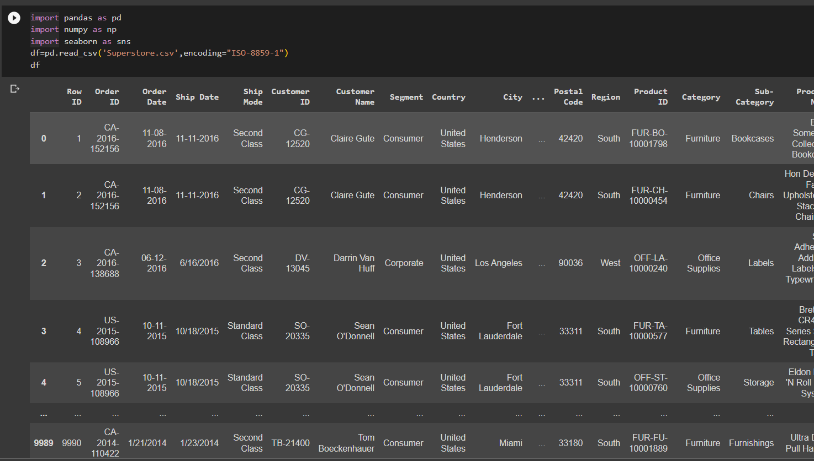
## Info
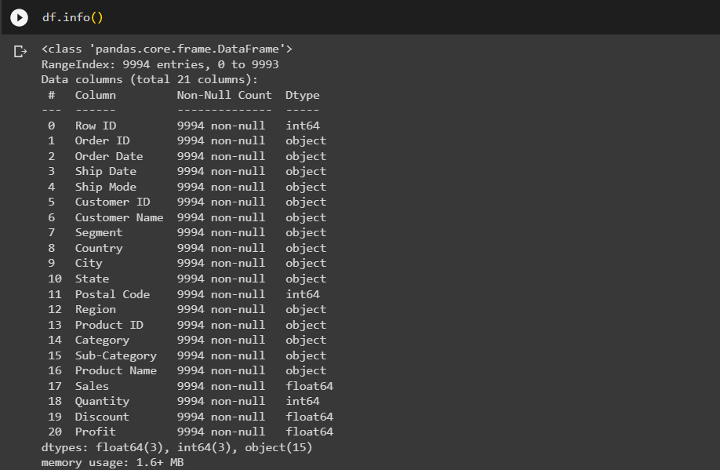
## Null values after cleaning
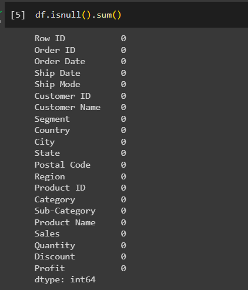
## Segment of High sales
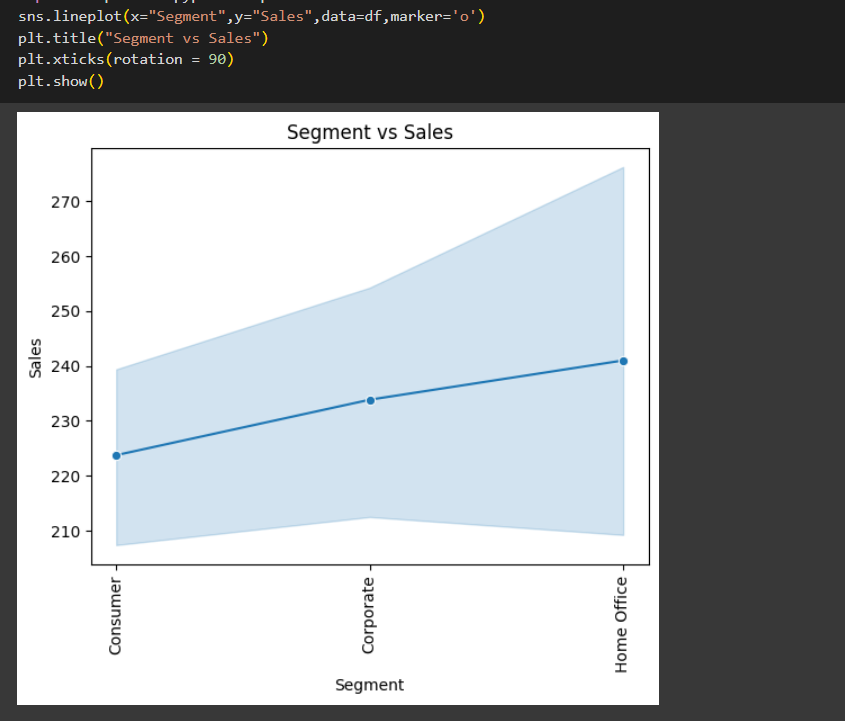
## City of High sales
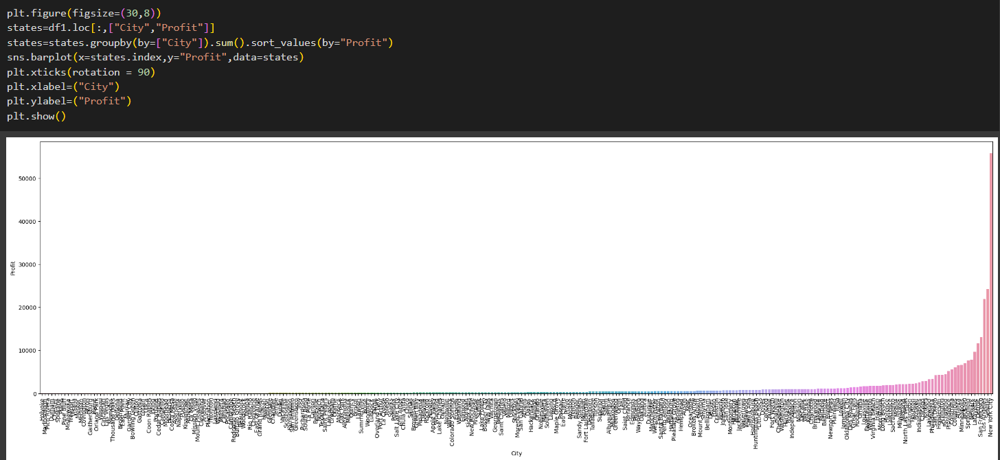
## Profitable Ship Mode
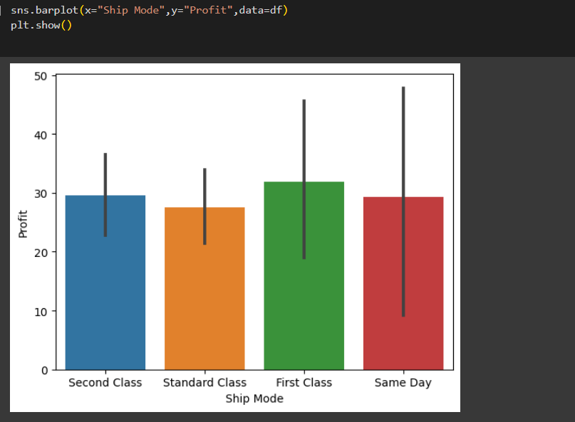
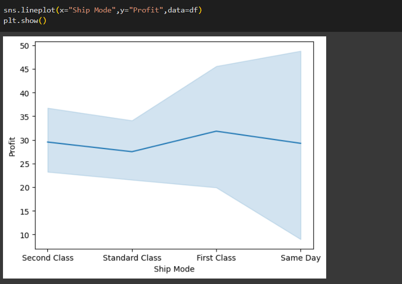
## Region based sales
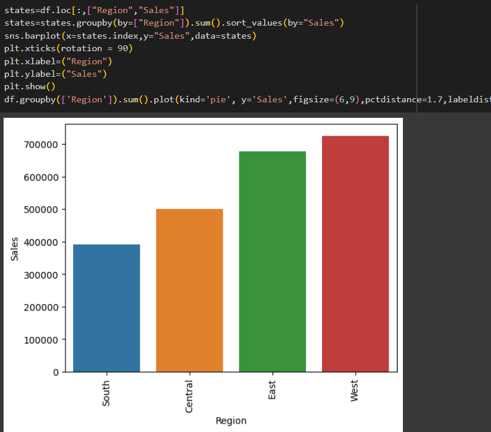
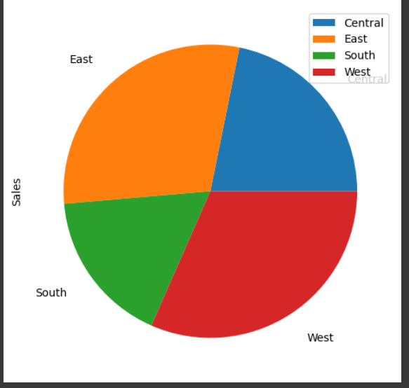
## Relation
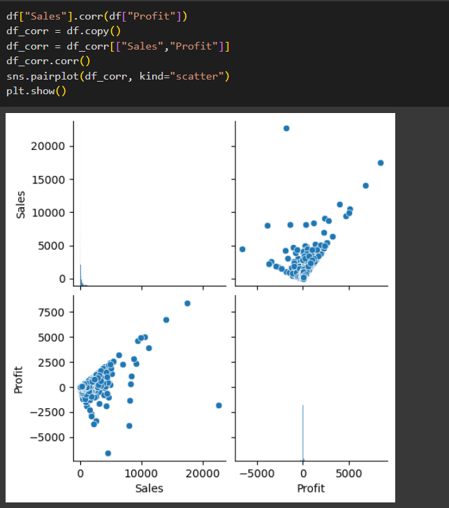
## Plot - Segment
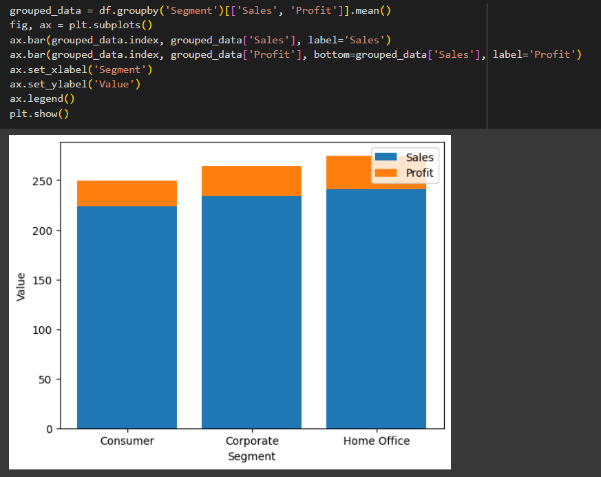
## Plot - City
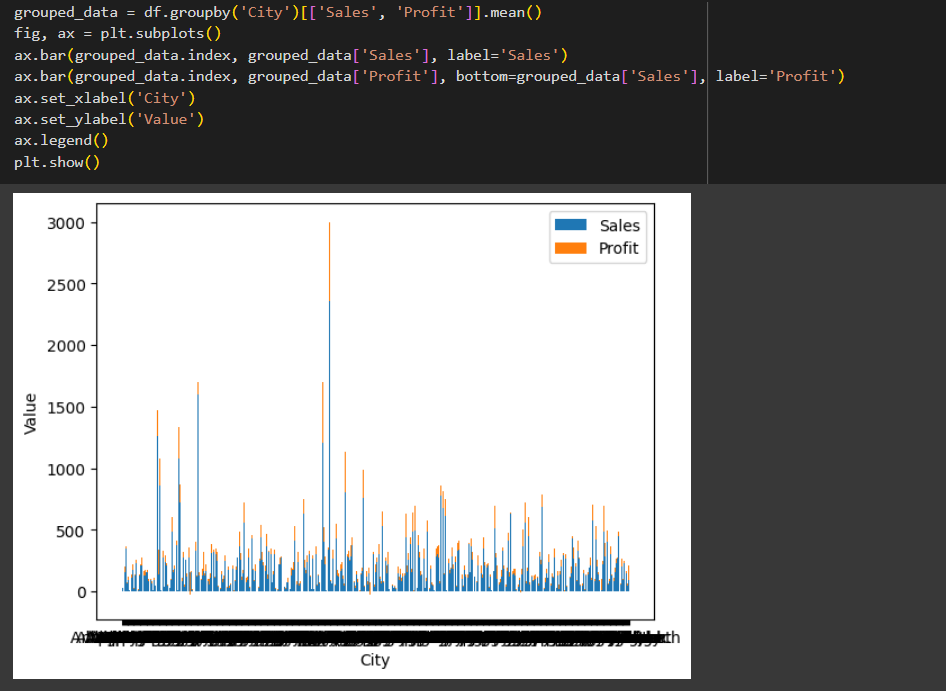
## Plot - States
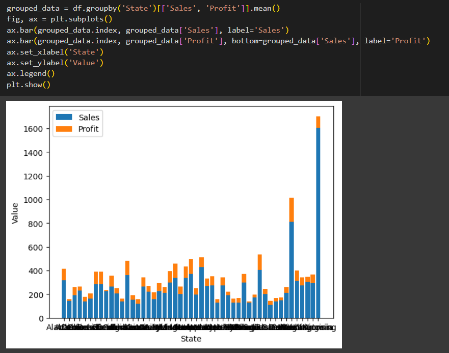
## Plot - Segment & Ship Mode
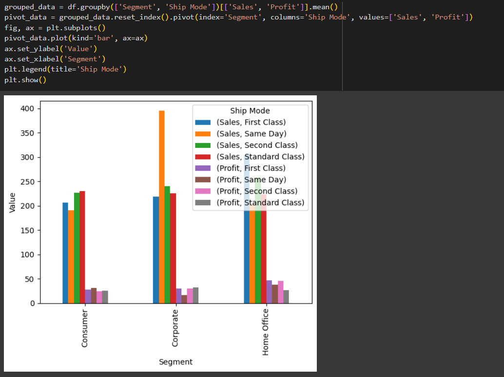
## Plot - Segment,Ship Mode & Region
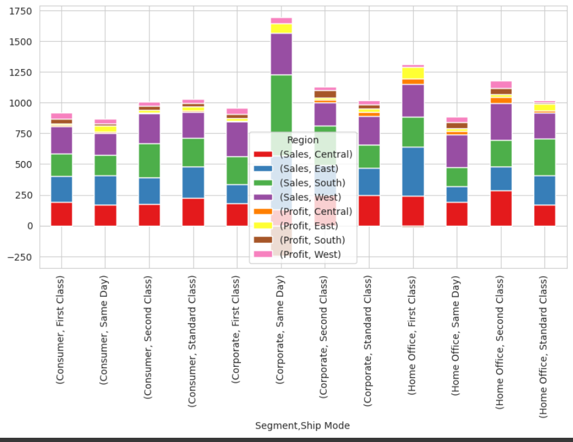

# RESULT

Thus, Data Visualization is performed on the given dataset and save the data to a file.


